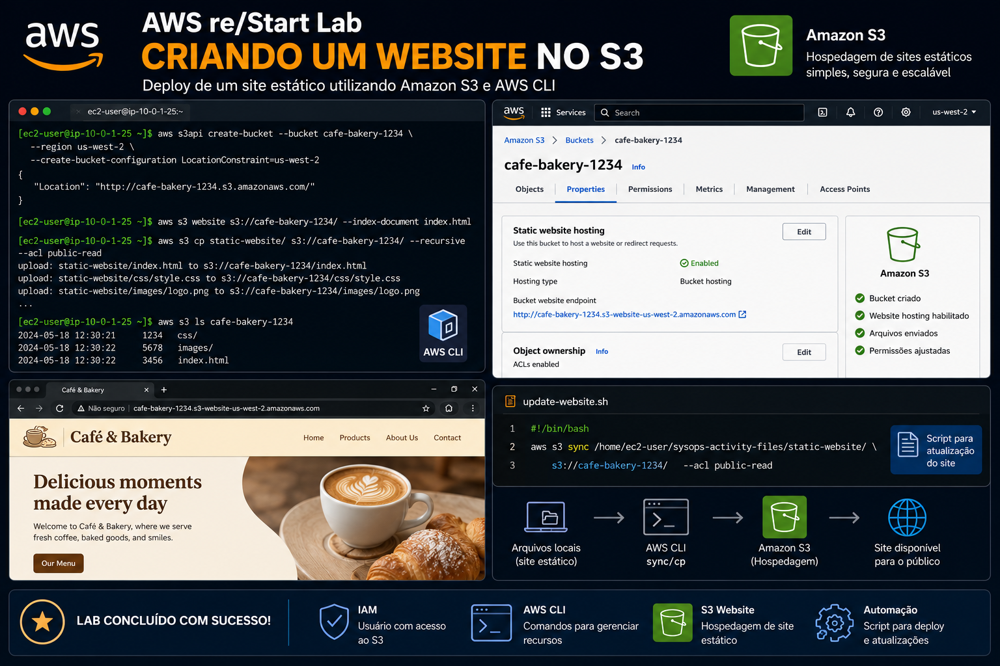
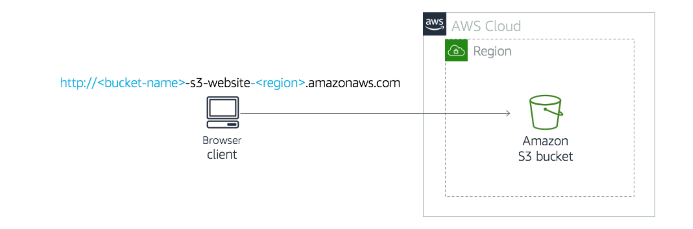
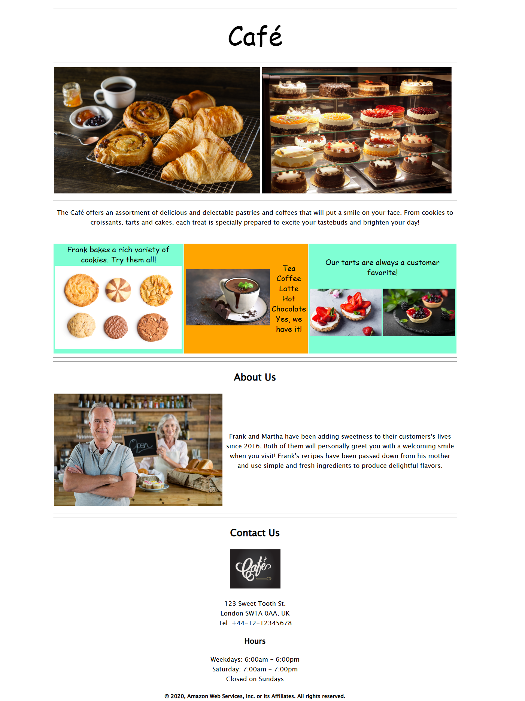
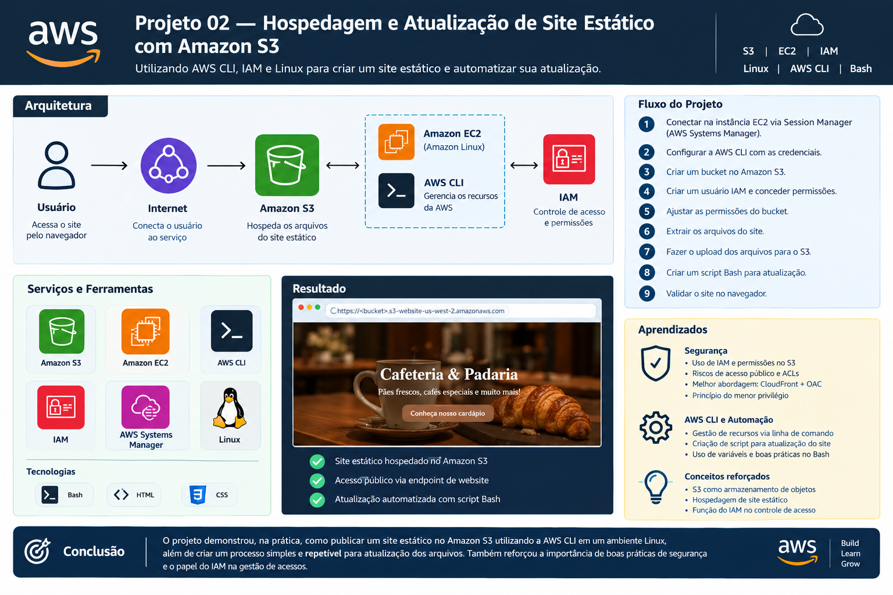

# Hospedagem e Atualização de Site Estático com Amazon S3

Como parte dos meus estudos em **Cloud Computing** e **AWS**, desenvolvi uma solução para hospedar um site estático utilizando o **Amazon S3**, realizando o gerenciamento dos recursos através da **AWS CLI** em uma instância Linux.

O laboratório teve como foco compreender, na prática, como utilizar a linha de comando para interagir com serviços da AWS, além de trabalhar com **IAM**, **Amazon S3**, **Linux**, **Bash** e hospedagem de sites estáticos.

Outro objetivo importante foi criar um processo de atualização repetível para o site, evitando a necessidade de executar manualmente todos os comandos de upload a cada alteração.

## 🎯 Objetivo

O objetivo foi:

- Conectar a uma instância Amazon Linux utilizando o AWS Systems Manager Session Manager;
- Configurar e utilizar a AWS CLI;
- Criar e gerenciar um bucket no Amazon S3;
- Criar um usuário IAM para gerenciamento do S3;
- Configurar permissões de acesso ao bucket;
- Hospedar um site estático no Amazon S3;
- Fazer upload dos arquivos utilizando a AWS CLI;
- Validar o funcionamento do site através do navegador;
- Criar um script Bash para automatizar futuras atualizações do site.

## 🏗️ Solução

A solução foi construída utilizando uma instância **Amazon EC2** com Linux como ambiente de execução da AWS CLI.

A partir dessa instância, foram executadas operações para criar e configurar um bucket no Amazon S3, realizar o upload dos arquivos do site e posteriormente automatizar o processo de atualização.

A arquitetura utilizada foi:

                  Amazon EC2
                 Amazon Linux
                      │
                      │ AWS CLI
                      ▼
                 ┌───────────┐
                 │   IAM     │
                 │Permissões │
                 └─────┬─────┘
                       │
                       ▼
                 ┌───────────┐
                 │    S3     │
                 │           │
                 │ index.html│
                 │    CSS    │
                 │  imagens  │
                 └─────┬─────┘
                       │
                       ▼
                 Static Website
                       │
                       ▼
                    🌐 Web
                   Browser

### 1. Acesso à instância Linux 🖥️

O primeiro passo foi estabelecer uma sessão com uma instância **Amazon Linux EC2** utilizando o **AWS Systems Manager Session Manager**.

A conexão foi realizada através do navegador, permitindo acessar o terminal da instância sem a necessidade de estabelecer uma conexão SSH tradicional.

Após a conexão, o ambiente foi preparado utilizando o usuário `ec2-user`.

A partir desse terminal foram executadas as demais atividades do laboratório.

### 2. Configuração da AWS CLI ⚙️

A instância Amazon Linux utilizada no laboratório já possuía a **AWS CLI** instalada.

A ferramenta foi configurada através do comando:

`aws configure`

Foram configurados:

*Access Key* 
*Secret Access Key* 
Default Region: `us-west-2` 
Output format: `json`

A partir desse momento, foi possível executar operações diretamente na infraestrutura AWS através do terminal.

### 3. Criação do bucket S3 🪣

Um bucket foi criado utilizando a AWS CLI através do comando:

aws s3api *create-bucket*\  
    --bucket *nome-do-bucket*\  
    --region us-west-2\  
    --create-bucket-configuration LocationConstraint=us-west-2

O bucket foi utilizado como armazenamento dos arquivos necessários para o site estático.

A utilização da AWS CLI permitiu realizar a criação do recurso sem depender exclusivamente do AWS Management Console.

### 4. Gerenciamento de acesso utilizando IAM 🔐

Como parte do exercício, foi criado um usuário IAM denominado:

`awsS3user`

Esse usuário recebeu uma política gerenciada que concedia acesso ao Amazon S3.

O objetivo dessa etapa foi demonstrar como identidades e permissões do **AWS Identity and Access Management (IAM)** podem ser utilizadas para controlar o acesso aos recursos da AWS.

#### ⚠️ Observação de segurança

O laboratório utilizou uma configuração de permissões mais ampla do que seria recomendável em um ambiente de produção, concedendo ao usuário acesso total ao Amazon S3.

Além disso, foram utilizadas credenciais fornecidas especificamente para o ambiente de treinamento.

Essa configuração não deve ser reproduzida dessa forma em um ambiente real.

Neste laboratório, entretanto, tratava-se de um ambiente controlado de aprendizagem, com credenciais e recursos destinados exclusivamente à execução das atividades. Por esse motivo, a configuração foi mantida para reproduzir os objetivos propostos pelo exercício.

Em um ambiente de produção, eu adotaria o princípio do **Menor Privilégio**, concedendo somente as permissões necessárias para executar as operações exigidas.

### 5. Configuração da hospedagem estática 🌐

O bucket foi configurado para funcionar como um **Site Estático**, utilizando o arquivo:

`index.html`

como documento principal.

A configuração foi realizada através da AWS CLI:

aws s3 website s3://*nome-do-bucket*/\  
    --index-document index.html

Após a configuração, o bucket passou a disponibilizar um endpoint específico para a hospedagem do site.

### 6. Upload dos arquivos 📤

Os arquivos da aplicação foram extraídos na instância Linux.

A estrutura utilizada continha:

static-website/  
│  
├── index.html  
├── css/  
└── imagens/

Os arquivos foram enviados para o bucket através da AWS CLI:

aws s3 cp\  
    /home/ec2-user/sysops-activity-files/static-website/\  
    s3://*nome-do-bucket*/\  
    --recursive\  
    --acl public-read

O parâmetro `--recursive` permitiu enviar todos os arquivos e diretórios da aplicação.

### ⚠️ Observação sobre acesso público e ACLs

Para reproduzir o laboratório, o bucket foi configurado permitindo acesso público e os arquivos foram enviados utilizando:

--acl public-read

Também foi necessário ajustar as configurações de acesso público e habilitar ACLs no bucket.

#### 🔒 Consideração de segurança

Essa configuração **não representa a abordagem que eu escolheria para uma aplicação real**.

Permitir acesso público diretamente ao bucket aumenta a superfície de exposição e o uso de ACLs para esse tipo de arquitetura é uma abordagem que deve ser avaliada com cuidado.

Neste caso, a configuração foi utilizada porque o laboratório foi realizado em um **ambiente controlado de treinamento**, cujo objetivo era demonstrar especificamente o funcionamento da hospedagem estática direta através do Amazon S3.

Para uma arquitetura de produção, uma abordagem mais segura seria manter os objetos privados e utilizar uma camada de distribuição, como **Amazon CloudFront**, controlando o acesso ao bucket através de uma política apropriada.

Essa diferença entre uma configuração adequada para um laboratório e uma configuração recomendada para produção foi um dos principais aprendizados deste projeto.

### 7. Validação do site 🧪

Após o upload dos arquivos, foi utilizado o comando:

`aws s3 ls <nome-do-bucket>`

para confirmar que os arquivos estavam presentes no bucket.

Também foi verificado no AWS Management Console se a hospedagem de site estático estava habilitada.

Por fim, o **Endpoint de site do bucket** foi acessado através do navegador.

O site foi carregado corretamente, confirmando o funcionamento da solução.

### 8. Automação da atualização do site 🔄

Uma das etapas mais importantes do projeto foi transformar o processo de atualização em uma tarefa repetível.

Para isso, foi criado o arquivo:

`update-website.sh`

O script contém o comando utilizado para copiar os arquivos atualizados para o bucket:

#!/bin/bash  
aws s3 cp\  
    /home/ec2-user/sysops-activity-files/static-website/\  
    s3://<nome-do-bucket>/\  
    --recursive\  
    --acl public-read

Depois, o arquivo recebeu permissão de execução:

`chmod +x update-website.sh`

A partir desse momento, uma atualização do site poderia ser realizada executando:

`./update-website.sh`

Isso transformou um processo manual em uma pequena rotina de automação utilizando **Bash** e **AWS CLI**.

### 9. Teste de atualização 🎨

Para validar o processo de atualização, o arquivo `index.html` foi modificado.

Foram realizadas alterações no conteúdo HTML da página, incluindo mudanças nas cores utilizadas pelo site.

Depois da alteração, o script foi executado:

`./update-website.sh`

Os arquivos modificados foram enviados novamente para o Amazon S3.

Após atualizar o navegador, as alterações foram refletidas no site.

Esse teste confirmou que o processo de atualização automatizado estava funcionando corretamente.

## 🛠️ Ferramentas e Serviços

### ☁️ AWS
- Amazon S3
- Amazon EC2
- AWS Systems Manager Session Manager
- AWS IAM
- AWS CLI

### 🐧 Linux
- Amazon Linux
- Bash
- VI
  
### 🌐 Web
- HTML
- CSS
- Static Website Hosting

## 📊 Resultado

Ao final do projeto, foi criado um **site estático hospedado no Amazon S3**, acessível através do endpoint de website do bucket.

O fluxo completo ficou:

Alteração no código
        │
        ▼
   index.html
        │
        ▼
update-website.sh
        │
        ▼
     AWS CLI
        │
        ▼
   Amazon S3
        │
        ▼
 Static Website
        │
        ▼
    Navegador

Além da hospedagem, foi criado um processo simples e repetível para atualizar os arquivos do site através de um script Bash.

## 🧠 Aprendizados

Este projeto proporcionou uma experiência prática com **AWS CLI, IAM, S3, Linux e automação através de Bash**.

Um dos principais aprendizados foi entender que os serviços da AWS podem ser administrados de diferentes formas. Embora o AWS Management Console seja uma interface bastante intuitiva, a AWS CLI permite automatizar operações e criar processos repetíveis.

Também foi possível compreender melhor a função do **Amazon S3 como armazenamento de objetos** e sua utilização para hospedagem de conteúdo estático.

### 🔐 Segurança e boas práticas

Outro aprendizado importante foi perceber a diferença entre uma solução criada para um **laboratório controlado** e uma arquitetura destinada à produção.

Durante o exercício foram utilizadas práticas como:

- Usuário IAM com permissões amplas para S3;
- Credenciais de acesso configuradas diretamente na AWS CLI;
- Bucket com acesso público;
- ACLs habilitadas;
- Objetos com `public-read`.

Essas configurações foram mantidas porque faziam parte das instruções do laboratório e estavam sendo executadas em um ambiente controlado de treinamento.

Entretanto, **não considero essas configurações como a abordagem ideal para produção**.

Em um ambiente real, eu buscaria:

- aplicar o princípio de menor privilégio;
- evitar credenciais permanentes quando possível;
- utilizar IAM Roles para workloads executados em EC2;
- manter buckets privados;
- controlar o acesso através de políticas;
- utilizar CloudFront quando necessário para distribuição do conteúdo;
- evitar exposição pública desnecessária dos objetos.

Esse exercício ajudou a compreender não apenas **como fazer uma configuração funcionar, mas também por que determinadas configurações podem representar riscos quando transportadas de um laboratório para um ambiente de produção**.

## 🏁 Conclusão

Este projeto demonstrou a criação e publicação de um site estático utilizando **Amazon S3**, além da utilização da **AWS CLI em um ambiente Linux** para administrar recursos e automatizar tarefas.

O principal resultado não foi apenas colocar um site no ar, mas compreender o fluxo entre **Linux → AWS CLI → IAM → S3 → hospedagem web**, além de desenvolver uma visão mais crítica sobre permissões, exposição pública e boas práticas de segurança.

